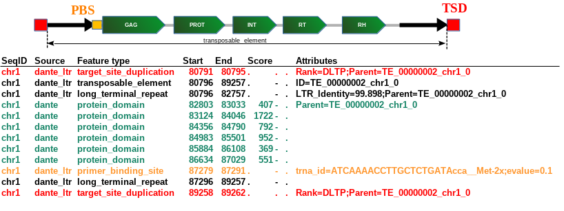

# PRACTICAL TRAINING DAY 1

# Input Data


| Description                            | Type  | File Name / Location                                      |
| -------------------------------------- | ----- | --------------------------------------------------------- |
| Genome assembly for repeat annotation  | FASTA | `/mnt/data/tiny_pea.fasta`                                |
| Tandem repeat library                  | FASTA | `/mnt/data/Tandem_repeat_library.fasta`                   |
| RepeatMasker custom library            | FASTA | `/mnt/data/RM_custom_library.fasta`                       |
| Configuration file for annotation pipeline | YAML  | `/mnt/data/config.yaml`                                   |
| Singularity container for annotation pipeline | SIF   | `/mnt/data/assembly_repeat_annotation_pipeline_0.6.7.sif` |

# Example Analysis on Full Data (*P. sativum* Cameor v2 Assembly)


| Description                     | Directory                                      |
| ------------------------------- | ---------------------------------------------- |
| TideCluster analysis            | `/mnt/data/example_analyses/TideCluster`       |
| DANTE analysis                  | `/mnt/data/example_analyses/DANTE`             |
| DANTE_LTR analysis              | `/mnt/data/example_analyses/DANTE_LTR`         |
| DANTE_TIR analysis              | `/mnt/data/example_analyses/DANTE_TIR`         |
| Full repeat annotation pipeline | `/mnt/data/example_analyses/RepeatAnnotations` |

# Conda Environments

## Available Environments

```bash
conda env list
```

```txt
# conda environments:
#
base                 * /home/helix/miniforge3
cd-hit                 /home/helix/miniforge3/envs/cd-hit
dante_ltr              /home/helix/miniforge3/envs/dante_ltr
dante_tir              /home/helix/miniforge3/envs/dante_tir
singularity            /home/helix/miniforge3/envs/singularity
tidecluster            /home/helix/miniforge3/envs/tidecluster
```

## Example Installations (do not run)

All programs can be installed using Mamba or Conda; examples use Mamba:

```bash
mamba create -n dante_ltr -c conda-forge -c bioconda -c petrnovak dante dante_ltr
mamba create -n dante_tir -c conda-forge -c r -c bioconda -c petrnovak dante_tir
mamba create -n singularity -c conda-forge -c bioconda singularity
mamba create -n tidecluster -c conda-forge -c bioconda -c petrnovak tidecluster
```

# Singularity Container for Repeat Annotation

The Singularity container (DOI:
[https://doi.org/10.5281/zenodo.15234515](https://doi.org/10.5281/zenodo.15234515)) can be downloaded from:

[https://zenodo.org/records/15234516/files/assembly_repeat_annotation_pipeline_0.6.7.sif?download=1](https://zenodo.org/records/15234516/files/assembly_repeat_annotation_pipeline_0.6.7.sif?download=1)

# TideCluster

> **Note:** The tool is under development; see [TideCluster
> GitHub](https://github.com/kavonrtep/TideCluster) for updates.
>
> **Credits**: TideCluster uses TideHunter for tandem repeat detection
> (Gao et al., *Bioinformatics* 35(14):i200--i207;
> [https://doi.org/10.1093/bioinformatics/btz376](https://doi.org/10.1093/bioinformatics/btz376))

## Installation (do not run; already installed)

```bash
mamba create -n tidecluster -c conda-forge -c bioconda -c petrnovak tidecluster
```

### Prerequisites

- Activate the `tidecluster` Conda environment.
- Working directory: `~/tidecluster/`.
- Input FASTA: `/mnt/data/tiny_pea.fasta`.
- Reference library (RepeatMasker format):
  `/mnt/data/Tandem_repeat_library.fasta`.
- CPU threads: adjust `-c` as needed (example uses 10).

## Running Individual Analysis Steps with Default Parameters

1. Open a terminal, switch to the TideCluster directory, and activate
   the environment:

   ```bash
   cd ~/tidecluster/
   conda activate tidecluster
   ```
2. Execute TideHunter:

   ```bash
   TideCluster.py tidehunter \
     -f /mnt/data/tiny_pea.fasta \
     -pr tiny_pea_default \
     -c 10
   ```

## Visualization in IGV

1. Launch IGV.
2. **Genomes → Load Genome from File** → select
   `/mnt/data/tiny_pea.fasta`.
3. **File → Load from File** → select:
   - `~/tidecluster/tiny_pea_default_tidehunter.gff3`
   - `~/tidecluster/tiny_pea_default_chunks.bed`
4. Right-click tracks to set:
   - `*_chunks.bed` → **Squished**
   - `*_tidehunter.gff3` → **Expanded**
5. **File → Save Session...**

## Clustering of Tandem Repeats

```bash
TideCluster.py clustering \
  -f /mnt/data/tiny_pea.fasta \
  -pr tiny_pea_default \
  -c 10
```

- Inspect results in IGV:
  - **File → Load from File** → select
    `~/tidecluster/tiny_pea_default_clustering.gff3`.

## Annotation Using Custom Reference Library

```bash
TideCluster.py annotation \
  -pr tiny_pea_default \
  -l /mnt/data/Tandem_repeat_library.fasta \
  -c 10
```

- Inspect results in IGV:
  - **File → Load from File** → select
    `~/tidecluster/tiny_pea_default_annotation.gff3`.

## Update GFF3 to Show Annotations from the Custom Library

1. Open `tiny_pea_default_annotation.tsv` in LibreOffice Calc (or
   Excel).
2. Sort by **Column C** (descending).
3. Remove rows with score \< 0.5.
4. Delete **Column C**.
5. Save as `tiny_pea_default_annotation_refDB.csv`.

```bash
tc_update_gff3.py \
  -g tiny_pea_default_annotation.gff3 \
  -t tiny_pea_default_annotation_refDB.csv \
  -o tiny_pea_default_annotation_refDB.gff3
```

- Inspect results in IGV:
  - **File → Load from File** → select
    `~/tidecluster/tiny_pea_default_annotation_refDB.gff3`.
  - **File → Save Session...**

## Consensus Sequence Generation with TAREAN

```bash
TideCluster.py tarean \
  -f /mnt/data/tiny_pea.fasta \
  -pr tiny_pea_default \
  -c 10
```

- Inspect `tiny_pea_default_tarean_index.html` in your web browser.

## Automatic Pipeline Execution (Short Monomers)

*In this example, we demonstrate automatic execution of all analysis
steps with custom settings to detect short monomer repeats.*

```bash
TideCluster.py run_all \
  -f /mnt/data/tiny_pea.fasta \
  -pr tiny_pea_short_monomers \
  -l /mnt/data/Tandem_repeat_library.fasta \
  -c 10 \
  -T "-p 10 -P 39 -c 5 -e 0.25"
```

- Inspect results in IGV:
  - **File → Load from File** → select:
    - `~/tidecluster/tiny_pea_short_monomers_tidehunter.gff3`
    - `~/tidecluster/tiny_pea_short_monomers_annotation.gff3`
  - **File → Save Session...**

> **Note:** No TAREAN output is generated if no repeat family passes the
> 50 kb total length cutoff.


## TideCluster output files

#### Tidehunter Step

The `prefix` is the prefix used in the command line  (with `-pr` option) so here it is `tiny_pea_default` and `tiny_pea_short_monomers`

- `prefix_tidehunter.gff3` - GFF3 file with tandem repeats detected by TideHunter.
- `prefix_chunks.bed` - BED file showing how the reference sequence was split into chunks for parallel processing.

#### Clustering Step

- `prefix__tidehunter_short.gff3` GFF3 file with tandem repeats shorter than the minimum length threshold used in the clustering step.
- `prefix_clustering.gff3` - GFF3 file with tandem repeats identified by `mmseqs2` and `BLASTN`.
  Tandem repeat regions in the GFF3 file are labeled by **T**andem **R**epeat **C**luster ID (TRC1, TRC2, etc.). Each TRC is described by the `repeat_type` attribute. `repeat_type` can be either TR (Tandem Repeat) or SSR (Simple Sequence Repeat).
- `prefix_clustering.gff3_1.gff3` - Intermediate file with tandem repeats clustered by `mmseqs2`.
- `prefix_consensus` - Directory with consensus sequences for each cluster as identified by TideHunter. There is one FASTA file per cluster. Each FASTA file contains all consensus sequences identified by TideHunter for a given cluster.
- `prefix_consensus_1` - Intermediate directory with consensus sequences for each cluster as identified by `mmseqs2`.
- `prefix_clustering_split_files` - Directory with GFF3 files, one for each TRC cluster. Each GFF3 file contains tandem repeat regions for a single TRC cluster.

#### Annotation Step

- `prefix_annotation.gff3` - GFF3 file with tandem repeats annotated by RepeatMasker.
  Annotations are shown as additional attributes in the GFF3 file.
- `prefix_annotation.tsv` - Summarized annotation for each TRC cluster in a tab-delimited format.
- `prefix_annotation_split_files` - Directory with GFF3 files, one for each TRC cluster.
  Each GFF3 file contains tandem repeat annotations for a single TRC cluster.

#### TAREAN Step

- `prefix_index.html` - Main HTML report, other reports are linked from this file.
- `prefix_tarean_report.html` - HTML report with tandem repeat annotations.
- `prefix_tarean_report.tsv` - File with tandem repeat annotations in a tab-delimited format.
- `prefix_kite_report.html` - HTML report with KITE analysis.
- `prefix_trc_superfamilies.html`  HTML report with TRC superfamilies.
- `prefix_trc_superfamilies.tsv`  File with TRC superfamilies in a tab-delimited format.
- `prefix_tarean` - Directory containing subdirectories with detailed TAREAN output for each TRC cluster.
- `prefix_consensus_dimer_library.fasta` - FASTA file with consensus sequences for
  each TRC cluster. This sequences can be used as a library for similarity based
  annotation using RepeatMasker. This file is created only for TRC clusters that
  pass the minimum combined length threshold.


# Annotation of Protein Domains with DANTE

## Prerequisites

- Activate the `dante_ltr` Conda environment.
- Working directory: `~/dante_ltr/`.
- Input FASTA: `/mnt/data/tiny_pea.fasta`.

## Running DANTE

```bash
conda activate dante_ltr
# Check versions
dante --version
dante_ltr --version
```

> **Note:** DANTE_LTR versions up to 0.3.5.3 are compatible with REXdb
> Viridiplantae v3.0. Versions ≥4.0.1 support REXdb Viridiplantae v3.0
> and v4.0. DANTE versions up to 0.1.9 include REXdb Viridiplantae 3.0;
> versions ≥0.2.0 include REXdb Viridiplantae 4.0.

```bash
mkdir ~/te_annotation
cd ~/te_annotation/
dante -q /mnt/data/tiny_pea.fasta -o DANTE.gff3 -c 15
```
> This step takes about 6 minutes


> **Note:** DANTE is optimized for genome assemblies. For many short
> sequences, use `-S (--short_reads)`.

DANTE.gff3 contains detected protein domain annotations and can be used
as input for DANTE_LTR and DANTE_TIR. For phylogenetic analyses, filter
domains using `dante_gff_output_filtering.py`.

### Example of Filtering DANTE Output

```bash
# Default filtering
dante_gff_output_filtering.py --dom_gff DANTE.gff3 \
  -ouf DANTE_filtered_default.gff3 \
  -dps DANTE_filtered_default.fasta
```

Default thresholds:

- Max interruptions: 3 (per 100 AA)
- Min alignment length proportion: 0.8
- Max alignment length proportion: 1.2
- Min alignment identity: 0.35
- Min alignment similarity: 0.45

```bash
# Default thresholds with additional filters for Ty3/gypsy and RT domains
dante_gff_output_filtering.py --dom_gff DANTE.gff3 \
  -el gypsy -sd RT \
  -ouf DANTE_filtered_Gypsy_RT.gff3 \
  -dps DANTE_filtered_Gypsy_RT.fasta
```

## Extracting DNA Sequences from Filtered DANTE Output

```bash
dante_gff_to_dna.py \
  -i /mnt/data/tiny_pea.fasta \
  -d DANTE_filtered_Gypsy_RT.gff3 \
  -out DANTE_filtered_Gypsy_RT_dna \
  -ex
```

DNA sequences are output to the specified directory, one FASTA file per
lineage.

# Identification of Full-Length LTR-Retrotransposons with DANTE_LTR

## Prerequisites

- Activate the `dante_ltr` Conda environment.
- Input FASTA: `/mnt/data/tiny_pea.fasta`.
- Unfiltered DANTE output: `DANTE.gff3`.

## Running DANTE_LTR

```bash
cd ~/te_annotation/
dante_ltr -g DANTE.gff3 -s /mnt/data/tiny_pea.fasta -o DANTE_LTR -c 5 -M 1
```

> **Details:** 
> - Input must be unfiltered DANTE GFF3.
> - Option `-M 1` sets the maximum missing protein domains.
> - `--te_constrains` specifies TE search constraints. Example of table with constraints can be found [here](https://github.com/kavonrtep/dante_ltr?tab=readme-ov-file#modifying-ltr-rt-search-constrains)
> - `--no_ambiguous_domains` removes ambiguous domains from analysis.
> 
> Command will take about 5 minutes to run.

**Output files:**

- `DANTE_LTR.gff3`: Annotated elements.
- Extracted DNA sequences:
  - `DANTE_LTR_D.fasta` (partial elements without LTRs)
  - `DANTE_LTR_DL.fasta` (elements with LTRs and protein domains)
  - `DANTE_LTR_DLP.fasta` (elements with LTRs, domains, PBS)
  - `DANTE_LTR_DLT.fasta` (elements with LTRs, domains, TSD)
  - `DANTE_LTR_DLTP.fasta` (complete elements with LTRs, domains,
    PBS, TSD)
- Summaries:
  - `DANTE_LTR_statistics.csv`
  - `DANTE_LTR_summary.csv`
  - `DANTE_LTR_summary.html`

## Structure of DANTE_LTR GFF3 file

Types of features in GFF3:

- **target_site_duplication**: This feature represents direct repeats around the insertion site of a transposable element.
- **transposable_element**: This is the main feature representing the full extent of a 
  transposable element within the genome.
- **long_terminal_repeat** (LTR): These are the direct repeats at the element's termini. 
- **protein_domain**: This feature indicates a specific polyprotein domain identified by DANTE.
- **primer_binding_site**: This feature represents the site where a tRNA primer binds to 
  initiate reverse transcription.

{width=70%}

Attributes of features in GFF3:

- **Rank**: Rank of the elements (D, DL, DLT, DLP, DLTP)
- **Parent**: Indicates the parent feature of the current feature, here a 
  transposable element ID.
- **Ndomains**: The number of protein domains found within a transposable element.
- **ID**: A unique identifier for the feature.
- **LTR_Identity**: The percentage of sequence identity between 5' and 3' LTR sequences.
- **LTR5_length** and **LTR3_length**: The lengths of the 5' and 3' LTRs, respectively.
- **TSD (Target Site Duplication)**: The sequence of the target site duplication.
- **Final_Classification**: A hierarchical classification of the transposable element 
  based on REXdb classification system
- **Name**: The attibute is part of DANTE output and correspod to name of protein 
  domain (RT. RH, PROT, ...)
- **trna_id**: The identifier for the tRNA related to the primer binding site.
- **PBS_evalue**: The E-value associated with the primer binding site.
- **Best_Hit**: Information about the best match of the protein domain to a known database entry.
- **Best_Hit_DB_Pos**: Position of the best hit within the database sequence.
- **DB_Seq**: The database sequence that corresponds to the best hit.
- **Region_Seq**: The sequence of the region where the query sequence was aligned to the database sequence.
- **Query_Seq**: The sequence of the query used to find the best hit.
- **Identity**: The percentage identity of the best hit match.
- **Similarity**: The similarity score of the best hit match.
- **Relat_Length**: The relative length of the match compared to the database sequence.
- **Relat_Interruptions**: Indicates the relative number of interruptions in the 
  domain sequence.Interuption could be either stop codon or frameshift.
- **Hit_to_DB_Length**: The length of the hit compared to the database sequence length.

Not all attributes are present in all features. Some are feature specific. 

## Creating an LTR-RT Library for RepeatMasker

```bash
dante_ltr_to_library -g DANTE_LTR.gff3 -s /mnt/data/tiny_pea.fasta -o DANTE_LTR_library -c 5 -m 5
```

> **Options:** - `-m 5`: minimum cluster coverage (default: 3). -
> `--proportion_min PROPORTION_MIN` (default: 0.95).

**Output (`DANTE_LTR_library/`):**

```
DANTE_LTR_library/
├── TE_DL.fasta
├── TE_DLP.fasta
├── TE_DLT.fasta
├── TE_DLTP.fasta
├── TE_DLplus.fasta
├── TE_all.fasta
└── mmseqs2/
    ├── mmseqs_all_seqs.fasta
    ├── mmseqs_cluster.tsv
    ├── mmseqs_rep_seq.fasta
    ├── mmseqs_representative_seq_clean.fasta
    ├── mmseqs_representative_seq_clean_rm_compatible.fasta  <- Custom library for RepeatMasker
    └── partitioned_s900_w1000.fasta
```

# Annotation of DNA Transposons with DANTE_TIR

> **Note:** The tool is under development; see [DANTE_TIR
> GitHub](https://github.com/kavonrtep/dante_tir) for updates.

## Prerequisites

- Activate the `dante_tir` Conda environment.
- Input FASTA: `/mnt/data/tiny_pea.fasta`.
- Unfiltered DANTE output: `DANTE.gff3`.

## Running DANTE_TIR

```bash
cd ~/te_annotation/
conda activate dante_tir
dante_tir.py -g DANTE.gff3 -f /mnt/data/tiny_pea.fasta -o DANTE_TIR -c 10
```

**Output (`DANTE_TIR/`):**

- `DANTE_TIR_final.gff3`: GFF3 file with TIR annotations.GFR3 file include following attributes:
  - `tir_seq5` and `tir_seq3`: 5' and 3' TIR sequences
  - `tsd` : target site duplication sequence
  - `Classification`: classification into superfamily
  - `ID` : unique ID of the element
- Extracted DNA sequences:
  - `DANTE_TIR_EnSpm_CACTA.fasta`
  - `DANTE_TIR_MuDR_Mutator.fasta`
  - `DANTE_TIR_hAT.fasta`
  - `DANTE_TIR_final.fasta` (all elements)
- `TIR_classification_summary.txt` (tabular summary)

DANTE_TIR GFF3 can be summarized using `dante_tir_summary.R` script. This script
generates a summary HTML report of the annotations. Additionally, the DNA transposon
sequences are clustered using `mmseq2` program and library of representative
sequences is generated. 

```bash
cd DANTE_TIR
dante_tir_summary.R -g DANTE_TIR_final.gff3 -f /mnt/data/tiny_pea.fasta -o DANTE_TIR_summary
```
Output directory will contain:
- `report.html`: HTML report with summary of TIR annotations
- `{superfamily}_representative_elements.csv`: Table with information about representative elements and respective clusters sizes (multiplicity)
- `{superfamily}_representative_elements_all.fasta`: FASTA file with all representative elements
- `{superfamily}_representative_elements_multiplicity3plus.fasta`: FASTA file with representative elements with multiplicity 3 or more


# Exploration of Results in IGV

1. Launch IGV.
2. Open previously saved session:
   - **File → Load Session...** → select
     `~/tidecluster/tiny_pea_default_igv_session.xml`.
3. Load additional files from DANTE, DANTE_LTR and DANTE_TIR analysis:
   - **File → Load from File...** → select:
     - `~/te_annotation/DANTE.gff3`
     - `~/te_annotation/DANTE_filtered_default.gff3`
     - `~/te_annotation/DANTE_LTR.gff3`
     - `~/te_annotation/DANTE_TIR/DANTE_TIR_final.gff3`
     

# Example Analysis on Complete Genome Assembly of *P.sativum* Cameor v2

Analysis by TideCluster, DANTE, DANTE_LTR and DANTE_TIR on the complete genome assembly is stored in
`/mnt/data/example_analyses/`

- Full `DANTE_LTR` report is available at
  `/mnt/data/example_analyses/DANTE_LTR/DANTE_LTR_summary.html`
- Full `DANTE_TIR` report is available at
  `/mnt/data/example_analysis/DANTE_TIR/DANTE_TIR_summary/report.html`

TODO - make IGV session file with all the outputs


# Analysis of DANTE output

## Prerequisites

-   Conda environments: `dante_ltr` and `cd-hit`.
-   Working directory: `~/domains`.
-   DANTE outputs: `/mnt/data/example_analyses/DANTE/`.
-   Input FASTA: `/mnt/data/Pisum_assembly_cameor_ver_2.fasta`.

### Filtering DANTE Output - selection of chromovirus RT domain sequences

```bash
# Activate dante_ltr conda environment
conda activate dante_ltr

# Create working directory
cd
mkdir domains
cd domains

# Extract RT domain sequences  
dante_gff_output_filtering.py \
   --dom_gff /mnt/data/example_analyses/DANTE/domains_filtered.gff \
   --selected_dom RT \
   --element_type "|chromovirus" \
   --output_dir ~/domains \
   --domains_filtered DANTE_filtered_RT-chromovirus.gff3 \
   --domains_prot_seq DANTE_filtered_RT-chromovirus.fasta
  
# Extract coding sequences for the selected RT domains
dante_gff_to_dna.py \
  --input_dna /mnt/data/Pisum_assembly_cameor_ver_2.fasta \
  --domains_gff DANTE_filtered_RT-chromovirus.gff3 \
  --out_dir DANTE_filtered_RT-chromovirus_dna
  
cat DANTE_filtered_RT-chromovirus_dna/*.fasta > DANTE_filtered_RT-chromovirus_dna.fasta
  
# Extract and extend coding sequences for the selected RT domains
dante_gff_to_dna.py \
  --input_dna /mnt/data/Pisum_assembly_cameor_ver_2.fasta \
  --domains_gff DANTE_filtered_RT-chromovirus.gff3 \
  --out_dir DANTE_filtered_RT-chromovirus_dna-ext \
  --extended  

cat DANTE_filtered_RT-chromovirus_dna-ext/*.fasta > DANTE_filtered_RT-chromovirus_dna-ext.fasta

# Compare DANTE_filtered_RT-chromovirus_dna.fasta and DANTE_filtered_RT-chromovirus_dna-ext.fasta
head -n 10 DANTE_filtered_RT-chromovirus_dna.fasta
head -n 10 DANTE_filtered_RT-chromovirus_dna-ext.fasta
```

### Alignment of RT protein and dna sequences using muscle

```bash
# Replace stop codon symbols "*" with unknown aminoacid symbols "x"
sed -i -e 's/*/x/g' DANTE_filtered_RT-chromovirus.fasta

# Inspect muscle options
muscle

# Align protein RT sequences using muscle with -super5 parameter (Fast)
muscle -super5 DANTE_filtered_RT-chromovirus.fasta -output DANTE_filtered_RT-chromovirus.aligned

# Do not do: align RT-coding sequences using muscle with -super5 parameter (Slow)
muscle -super5 DANTE_filtered_RT-chromovirus_dna.fasta -output DANTE_filtered_RT-chromovirus_dna.aligned

muscle -super5 DANTE_filtered_RT-chromovirus_dna-ext.fasta -output DANTE_filtered_RT-chromovirus_dna-ext.aligned
```

-   Inspect the alignments in SeaView:
    -   **File → Open** → select:
        -   `~/domains/DANTE_filtered_RT-chromovirus.aligned`
        -   `/mnt/data/example_analyses/DANTE/alignments/DANTE_filtered_RT-chromovirus_dna.aligned`
        -   `/mnt/data/example_analyses/DANTE/alignments/DANTE_filtered_RT-chromovirus_dna-ext.aligned`

### Sequence clustering using cd-hit

```bash
# Activate cd-hit conda environment
conda activate cd-hit

# Inspect cd-hit options
cd-hit

# Cluster RT protein domain sequences
cd-hit -i DANTE_filtered_RT-chromovirus.fasta -o DANTE_filtered_RT-chromovirus.cd-hit -c 0.95 -d 0 -T 10 -S 10

# Cluster RT-coding sequences
cd-hit-est -i DANTE_filtered_RT-chromovirus_dna.fasta -o DANTE_filtered_RT-chromovirus_dna.cd-hit -c 0.95 -d 0 -T 10 -S 30
```

**Outputs:**

-   representative sequences in fasta format:
    -   `DANTE_filtered_RT-chromovirus.cd-hit`
    -   `DANTE_filtered_RT-chromovirus_dna.cd-hit`
-   unsorted cluster files
    -   `DANTE_filtered_RT-chromovirus.cd-hit.clstr`
    -   `DANTE_filtered_RT-chromovirus_dna.cd-hit.clstr`

### Sorting and formatting cd-hit outputs

```bash
# Sort cd-hit clusters
clstr_sort_by.pl < DANTE_filtered_RT-chromovirus.cd-hit.clstr > DANTE_filtered_RT-chromovirus.cd-hit.clstr.sorted

clstr_sort_by.pl < DANTE_filtered_RT-chromovirus_dna.cd-hit.clstr > DANTE_filtered_RT-chromovirus_dna.cd-hit.clstr.sorted

# Format the sorted clusters into a table
clstr2txt.pl DANTE_filtered_RT-chromovirus.cd-hit.clstr.sorted > DANTE_filtered_RT-chromovirus.cd-hit.clstr.sorted.tab

clstr2txt.pl DANTE_filtered_RT-chromovirus_dna.cd-hit.clstr.sorted > DANTE_filtered_RT-chromovirus_dna.cd-hit.clstr.sorted.tab
```

### Merging cd-hit cluster table with sequence annotations

```bash
# sort cd-hit cluster table based on the first column (names)
cat DANTE_filtered_RT-chromovirus.cd-hit.clstr.sorted.tab | grep -v "id  clstr" | sort -k1,1 > temp_table_1

# extract annotations from protein sequence fasta file ()
cat DANTE_filtered_RT-chromovirus.fasta | grep ">" | cut -d " " -f1,3 --output-delimiter=$'\t' | cut -d ">" -f2 > classifications

# sort classification table based on the first column (names)
cat classifications | sort -k1,1 > temp_table_2

# combine the tables (they must have same number of lines and must be sorted)
join -t$'\t' temp_table_1 temp_table_2 | sort -k2,2n -k5,5nr > DANTE_filtered_RT-chromovirus.cd-hit.clstr.sorted.tab.class

rm temp_table_*
```

-   Inspect cluster annotations in LibreOffice Calc:
    -   **File → Open** → select:
        -   `~/domains/DANTE_filtered_RT-chromovirus.cd-hit.clstr.sorted.tab.class`

### Identification of the most abundant family in a particular lineage (CRM) and calculating its DNA consensus sequence

```bash
# Print all representatives of cd-hit clusters annotated as CRM and having at least two members ($# in awk commands specify the column number; i.e. $3 is the 3rd column which is clstr_size and $5 is the 5th column which is "clstr_rep")
cat DANTE_filtered_RT-chromovirus.cd-hit.clstr.sorted.tab.class | grep "Class_I|LTR|Ty3/gypsy|chromovirus|CRM" | awk '$5==1' | awk '$3>1'

# Print all lines from the cd-hit cluster 8, the biggest CRM cluster (cluster number is in the 2nd column)
cat DANTE_filtered_RT-chromovirus.cd-hit.clstr.sorted.tab.class | grep "Class_I|LTR|Ty3/gypsy|chromovirus|CRM" | awk '$2==8'

# Extract sequence names for the cd-hit cluster 8 (names are in the 1st column)
cat DANTE_filtered_RT-chromovirus.cd-hit.clstr.sorted.tab.class | grep "Class_I|LTR|Ty3/gypsy|chromovirus|CRM" | awk '$2==8' | cut -f1 > DANTE_filtered_RT-chromovirus.cd-hit.clstr.sorted_CL8-CRM.list

# extract DNA sequences for the cd-hit cluster 8
seqtk subseq DANTE_filtered_RT-chromovirus_dna.fasta DANTE_filtered_RT-chromovirus.cd-hit.clstr.sorted_CL8-CRM.list > DANTE_filtered_RT-chromovirus.cd-hit.clstr.sorted_CL8-CRM_dna.fasta

# align DNA sequences extracted from the cd-hit cluster 8
muscle -align DANTE_filtered_RT-chromovirus.cd-hit.clstr.sorted_CL8-CRM_dna.fasta -output DANTE_filtered_RT-chromovirus.cd-hit.clstr.sorted_CL8-CRM_dna.aligned

# align all CRM RT-coding sequences (to compare with CL8-CRM)
muscle -align DANTE_filtered_RT-chromovirus_dna/CRM.fasta -output DANTE_filtered_RT-chromovirus_dna-CRM_all.aligned
```

Inspect the CRM RT alignments in SeaView:

-   **File → Open** → select:
    -   `~/domains/DANTE_filtered_RT-chromovirus.cd-hit.clstr.sorted_CL8-CRM_dna.aligned`
-   **File → Props** **→ Consensus options → Edit threshold** →
    -   set consensus threshold value to 90%
    -   tick off "allow gaps"
-   Use `ctrl-A` to select all sequences in the alignment
-   **Edit → Consensus sequence**

### Phylogenetic analysis of all CRM RT-coding DNA sequences

In terminal:

```bash
# Replace colons with two underlines (colons in names interfere with tree formats)
sed -i -e 's/:/__/g' DANTE_filtered_RT-chromovirus_dna-CRM_all.aligned
```

In Seaview:

-   **File → Open** → select:
    -   `~/domains/DANTE_filtered_RT-chromovirus_dna-CRM_all.aligned`

<!-- -->

-   **Trees → Distance methods** → select:
    -   BioNJ
    -   Ignore all gap sites: No
    -   Distance: Observed
    -   Bootstrap: 100
    -   Save to File
        -   `~/domains/DANTE_filtered_RT-chromovirus_dna-CRM_all-BioNJ_tree`

In Terminal, prepare lists

```bash
# Select and rename domains from clusters having only member (cluster size is in the 3rd column)
cat DANTE_filtered_RT-chromovirus.cd-hit.clstr.sorted.tab.class \
| grep "Class_I|LTR|Ty3/gypsy|chromovirus|CRM" \
| awk '$3==1' \
| cut -f1 \
| sed -e 's/:/__/g' \
> DANTE_filtered_RT-chromovirus.cd-hit.clstr.sorted_CRM-singlets.list

# Select and remain domains from the cluster 8 (the biggest CRM cluster; cluster number is in the 2nd column)
cat DANTE_filtered_RT-chromovirus.cd-hit.clstr.sorted.tab.class \
| grep "Class_I|LTR|Ty3/gypsy|chromovirus|CRM" \
| awk '$2==8' \
| cut -f1 \
| sed -e 's/:/__/g' \
> DANTE_filtered_RT-chromovirus.cd-hit.clstr.sorted_CRM-CL8.list

# Select and remain domains from the cluster 34 (the 2nd biggest CRM cluster; cluster number is in the 2nd column)
cat DANTE_filtered_RT-chromovirus.cd-hit.clstr.sorted.tab.class \
| grep "Class_I|LTR|Ty3/gypsy|chromovirus|CRM" \
| awk '$2==34' \
| cut -f1 \
| sed -e 's/:/__/g' \
> DANTE_filtered_RT-chromovirus.cd-hit.clstr.sorted_CRM-CL34.list
```

In Dendroscope:

-   **File → Open** → select (labels at internal nodes are bootstrap
    values):
    -   `~/domains/DANTE_filtered_RT-chromovirus_dna-CRM_all_renamed-BioNJ_tree`
-   **View → Radial Labels** → tick off
-   **Edit → Find**
    -   tick off "Whole words only"
    -   click on the folder icon and select
        -   `DANTE_filtered_RT-chromovirus.cd-hit.clstr.sorted_CRM-singlets.list`
        -   `DANTE_filtered_RT-chromovirus.cd-hit.clstr.sorted_CRM-CL8.list`
        -   `DANTE_filtered_RT-chromovirus.cd-hit.clstr.sorted_CRM-CL34.list`

### Phylogenetic analysis using protein domain sequences

> **Notes:** Protein sequences are easier to work with when analyzing
> sequences from multiple lineages of LTR retrotransposons.
>
> Phylogenetic analysis of large datasets is computationally demanding.
> Remove redundant sequences. Also consider removing sequences that are
> mutated, especially those that possess frame-shift and/or stop codon
> mutations, internal deletions / insertions / duplications, or that are
> end-truncated.
>
> Check and manually edit sequence alignments if needed.

``` bash
# Select domains from clusters with at least five members
cat DANTE_filtered_RT-chromovirus.cd-hit.clstr.sorted.tab | awk '$3>4' | awk '$5==1' | cut -f1 > DANTE_filtered_RT-chromovirus.cd-hit.clstr.sorted-reps01.list

# extract the sequences for analysis
seqtk subseq DANTE_filtered_RT-chromovirus.cd-hit DANTE_filtered_RT-chromovirus.cd-hit.clstr.sorted-reps01.list > DANTE_filtered_RT-chromovirus.cd-hit.clstr.sorted-reps01_prot.fasta

# Rename the sequences (sequence names must not contain colons)
sed -i -e 's/:/__/g' DANTE_filtered_RT-chromovirus.cd-hit.clstr.sorted-reps01_prot.fasta

# Align the sequences using muscle
muscle -align DANTE_filtered_RT-chromovirus.cd-hit.clstr.sorted-reps01_prot.fasta -output DANTE_filtered_RT-chromovirus.cd-hit.clstr.sorted-reps01_prot.aligned
```

-   Inspect the alignment in SeaView and calculate phylogenetic tree:
    -   **File → Open** → select:
        -   `~/domains/DANTE_filtered_RT-chromovirus.cd-hit.clstr.sorted-reps01_prot.aligned`
            -   for comparison open also
                `~/domains/DANTE_filtered_RT-chromovirus.aligned`
    -   Use `ctrl-A` to select all sequences in the alignment
    -   **Trees → Distance methods** → select:
        -   BioNJ
        -   Distance: Observed
        -   Bootstrap: 1000

